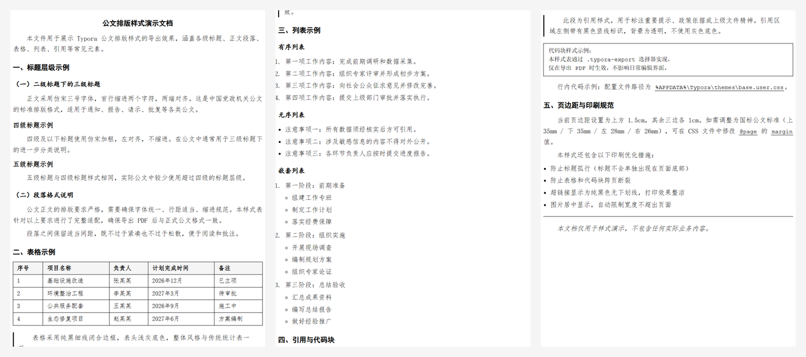

# Typora 公文排版样式

为 Typora 注入中国党政机关公文风格的 PDF 导出排版样式。

## 效果预览



[下载示例 PDF](preview.pdf)

## 特性

- **仿宋正文**：三号字 (21px)，行高 1.6，首行缩进 2 字符，两端对齐
- **标题层级**：h1 黑体居中，h2 黑体靠左，h3 楷体靠左，h4+ 仿宋加粗靠左
- **表格**：纯黑细线闭合边框，传统统计表风格
- **列表**：每级缩进 1em，列表内段落取消首行缩进
- **现代元素降级**：blockquote / code / pre 去除灰色背景
- **印刷优化**：防孤行、防断页、超链接纯黑无下划线

## 一键安装

在 PowerShell 中执行：

```powershell
irm https://raw.githubusercontent.com/kue0000/typora-govdoc-css/master/install.ps1 | iex
```

脚本会自动下载样式文件并安装到 Typora 所有已安装主题中，安装后重启 Typora 即可。

## 手动安装

1. 下载 `base.user.css` 并复制到 Typora 主题目录：
   - **Windows**：`%APPDATA%\Typora\themes\base.user.css`
   - **macOS**：`~/Library/Application Support/abnerworks.Typora/themes/base.user.css`

2. 如果你使用的是特定主题（如 GitHub），同时复制一份并重命名为 `{主题名}.user.css`，例如：
   - `github.user.css`（GitHub 主题）
   - `night.user.css`（Night 主题）

3. 重启 Typora。

## 验证

导出任意 Markdown 文件为 PDF（文件 → 导出 → PDF），检查字体和排版是否生效。

> **注意**：Typora 的 PDF 导出使用 `.typora-export` 类选择器，而非 `@media print`。本样式已针对此机制做了适配。

## 一键禁用

打开 `base.user.css`，将文件顶部附近的：

```css
.typora-export {
```

改为：

```css
/* .typora-export {
```

并在文件末尾的 `}` 后添加 `*/`，即可整块注释掉所有样式，恢复 Typora 默认导出效果。

## 页边距配置

当前页边距设置为 `上 1.5cm / 左右下 1cm`。如需调整，在文件中搜索 `@page` 并修改 `margin` 值：

```css
@media print {
    @page {
        size: A4;
        margin: 1.5cm 1cm 1cm 1cm; /* 上 右 下 左 */
    }
}
```

## 系统字体要求

需要系统中安装以下字体（Windows 默认已包含）：

- 仿宋 (FangSong)
- 黑体 (SimHei)
- 楷体 (Kaiti)

## 技术说明

Typora 在导出 PDF 时会给 `<body>` 添加 `typora-export` 类。本样式使用 `.typora-export` 作为选择器前缀，确保：

- 仅在 PDF 导出时生效
- 不影响日常编辑界面的主题样式
- 优先级高于 Typora 内置主题 CSS（通过 `!important`）

## 许可证

MIT License
